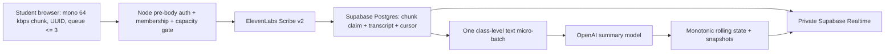

# Hybrid transcription and rolling-summary architecture

Status: implemented and locally verified on 2026-07-21. Production migration and deployment were intentionally not run.

## Product contract

- The browser records independent mono-friendly chunks. The target is 64 kbps and about 30 seconds per chunk; the first chunk is offset by up to five seconds per group to avoid a synchronized upload spike.
- Quiet chunks are discarded in the browser. The server also treats provider-classified silence/audio events as successful `no_speech` chunks.
- A chunk receives one client UUID before its first upload. The same ID is used for all retries. At most three chunks are retained in a browser's sequential pending chain.
- The Node service is the only live-audio bridge. It authenticates the native anonymous Supabase identity, verifies its exact session/group membership, verifies that the session can still accept uploads, and acquires capacity **before** Multer buffers the request body.
- Live audio is limited to 2 MiB by default, checked by MIME and magic bytes, cancelled on client disconnect, and bounded by a provider timeout. It is sent to ElevenLabs Scribe v2, then dereferenced immediately. Audio is not written to disk, Postgres, Supabase Storage, Realtime, logs, or an Edge Function.
- `live_audio_chunks` makes `(session_id, group_id, client_chunk_id)` unique. Completed/no-speech replays return success without another provider call; in-flight replays return HTTP 425; failed claims can be retried with the same ID.
- Transcript metadata/text is persisted before any Realtime broadcast. The upload response does not wait for summary generation.
- The teacher's rolling-summary interval is stored in `sessions.summary_interval_ms`. It defaults to exactly 30,000 ms and the server accepts only 15,000–300,000 ms. The teacher UI exposes 15–300 seconds, saves on blur, and restores the value after reload.
- One session timer coalesces available deltas from every group into one normal OpenAI request. Audio and transcript segments are never combined across groups: every structured request item retains its allowlisted group ID.
- Rolling summaries default to `gpt-5-nano` through the Responses API with `reasoning.effort: minimal`, low verbosity, bounded output, `store: false`, and a stable cache key. The static instruction is kept first for automatic prompt-cache eligibility; the short, changing transcript delta is deliberately last. The request is usually below the 1,024-token cache threshold, so no cost estimate assumes cache hits.
- Each group request contains its previous structured summary plus segments after its durable cursor. Missing/malformed group results are ignored independently; valid group results still commit. Late transcripts are picked up in the next batch.
- `rolling_summary_jobs` persists pending work across process restarts. A five-second recovery poll reclaims due jobs and running jobs whose 135-second lease has gone stale. `commit_rolling_summary` provides `(group, target cursor, prompt version)` idempotency, a monotonic version, and an update condition that rejects stale cursors. Every accepted state creates the existing summary snapshot/checkpoint. Every twentieth state reconciles from the group's transcript, and stop/expiry requests a final flush after the 15-second final-upload grace.
- Supabase private Broadcast remains a delivery optimization. Student reload rebuilds released summary/checklist state from Postgres; teacher reload rebuilds group transcript/summary state from Postgres. Students receive only the shared student topic and their group topic; teachers receive only the authorized classroom teacher topic.

## Data flow



## Database migration

The additive migration is:

`server/db/migrations/20260728_hybrid_live_audio_and_rolling_summaries.sql`

It adds the bounded session setting, live chunk claims, durable rolling jobs/states/commits, and the pinned-search-path commit function. All new tables have RLS enabled, all browser grants are revoked, and only `service_role` can execute the commit function. The production migration runner includes this file and reapplies the service-only hardening migration last.

### Deliberate Edge Function divergence

The summary coordinator remains a text-only Node worker in this compatible implementation. The fortified repository has no Supabase Edge Function project, local Edge runtime, deployment configuration, or tested privileged-auth contract, and all application tables are intentionally service-only behind Express. Adding a second unverified privileged boundary would duplicate summary/auth logic and weaken the current assurance. Durable jobs, cursors, commits, and summary state are still in Supabase; the Node process only claims text jobs and calls the model. Moving that small worker to an Edge Function later is possible, but should be a separate change with local Edge tests, secret provisioning, and deployment authorization. This divergence does not route audio through Supabase.

Do not deploy the corresponding Node build before the migration is present. With explicit production-change authorization and the verified archive variables already prepared, run the existing archive-gated command:

```sh
npm run db:migrate:production
```

Then verify in Supabase SQL Editor:

```sql
select summary_interval_ms from public.sessions limit 1;
select relname, relrowsecurity
from pg_class
where relname in ('live_audio_chunks', 'rolling_summary_jobs', 'rolling_summary_states', 'rolling_summary_commits');
```

All four `relrowsecurity` values must be `true`.

## Runtime configuration

Recommended initial values for the current 512 MiB Node service:

```dotenv
LIVE_AUDIO_MAX_BYTES=2097152
LIVE_AUDIO_MAX_CONCURRENCY=4
LIVE_AUDIO_CHUNK_MS=30000
SUMMARY_GRACE_MS=3000
SUMMARY_RECONCILE_EVERY=20
SUMMARY_MODEL=gpt-5-nano
PROVIDER_TIMEOUT_MS=60000
```

These are server-only values. `SUPABASE_SECRET_KEY`, provider keys, and cookie/join secrets must remain Run Time secrets and must never use a `VITE_` prefix. Only the Supabase URL and publishable key are browser configuration.

The safe initial concurrency is **4**, not a capacity guarantee. The measured accelerated test used 120 × 240 kB chunks, a simulated 250 ms provider, and a compressed three-second stagger window. It completed with zero errors, max active 4, 22,315,008 bytes peak RSS growth, 7.695 seconds elapsed, p50 4.025 seconds and p95 7.369 seconds. The high accelerated queue wait proves that provider latency/concurrency is the bottleneck. At the real average of two chunks/second, four slots require provider latency below roughly two seconds to avoid sustained queue growth. Measure actual provider latency before increasing concurrency or claiming 60-recorder headroom.

Safe metrics are exposed only to an authenticated admin at `GET /api/operations/metrics`: active/capacity, admitted and capacity-rejected requests, byte counts, provider calls/errors/latency, summary batches/groups/tokens/errors. It contains no raw audio, transcript, student identifier, token, credential, signed URL, or prompt text.

## Cost basis (prices checked 2026-07-21)

Workload: 10 classes × 6 groups, five 30-minute lessons per class each month = 50 classroom sessions, 18,000 group chunks, 150 group-audio-hours, and about 3,000 class summary calls at the 30-second default.

| Item | Assumption | Estimated monthly cost (USD) |
|---|---|---:|
| DigitalOcean Basic Droplet | 512 MiB, 1 vCPU, 500 GiB transfer included; about 4.3 GB provider-bound audio | $4.00 |
| ElevenLabs Scribe v2 | 150 audio hours × $0.22/hour, before taxes; no entity/keyterm add-ons | $33.00 |
| OpenAI `gpt-5-nano` | 3,000 calls; about 4.5M input and 1.8M output tokens at $0.05/$0.40 per 1M; excludes cache savings | $0.95 |
| Supabase Pro | Base plan, database/Auth/Realtime within included quotas; no live audio Storage | $25.00 |
| Supabase Storage/egress overage | No live audio stored; estimated text/Realtime traffic below included quota | $0.00 |
| **Production estimate** | Excludes taxes and provider plan commitments | **about $62.95/month** |

Supabase Free can make the experimental total about $37.95/month, but its project pausing and lack of production backup/support guarantees make Pro the recommended production basis. The text database is expected to remain well below the Pro 8 GB and 250 GB egress allowances; actual usage metrics, transcript verbosity, and provider billing remain authoritative.

Official pricing references:

- DigitalOcean Droplets: https://www.digitalocean.com/pricing/droplets
- ElevenLabs API: https://elevenlabs.io/pricing/api
- OpenAI `gpt-5-nano`: https://developers.openai.com/api/docs/models/gpt-5-nano
- Supabase: https://supabase.com/pricing

## Verification and security evidence

Completed locally:

- 81 Node unit/API/adversarial tests.
- 25-group summary + checkbox Realtime integration test, including one micro-batch and independent per-group commits.
- Production Vite build.
- Browser regression suite.
- Browser security suite: HttpOnly restoration, no Web Storage auth, forced end, interval persistence, and single/double-encoded traversal plus `.env`, `.git`, source, archive and `node_modules` denial.
- Accelerated 60-recorder/120-chunk admission test described above.
- One live `gpt-5-nano` Responses API rolling-summary smoke request, returning a bounded structured result without logging its content.
- `npm audit --audit-level=moderate`: zero vulnerabilities.
- Gitleaks over `server`, `client`, `scripts`, `tests`, and `docs`: no leaks. A whole-directory scan found only the deliberately ignored local `.env`; it was not read or modified and is not tracked.
- Manual source/SQL review: application database access uses Supabase SDK filters/RPC arguments; no request-built SQL exists. All `SECURITY DEFINER` functions use an empty pinned `search_path`; dynamic archive/hardening SQL uses catalog-derived identifiers with PostgreSQL `%I` quoting.
- Provider destinations are fixed allowlisted HTTPS constants. CSP, exact production Origin/Host checks, strict cookies, private Realtime memberships, RLS/revoked browser grants, rate limits, upload validation, stale-write protection, Markdown sanitization, and static realpath containment remain enabled.

Semgrep and Sonar Scanner were not installed in this workspace, so no result is claimed for them. The focused adversarial tests and source/SQL audit cover the changed boundaries; installing another scanner is optional and should not replace these runtime authorization tests.

## Production handoff

Production/cloud state was not changed. The remaining authorized sequence is:

1. Apply the archive-gated database migration.
2. Add the server-only runtime variables above to DigitalOcean; leave the existing secrets untouched.
3. Run the deployment preflight and local core gate.
4. Deploy only after explicit authorization.
5. Use one teacher and two anonymous students in different groups. Confirm cross-group denial, quiet-chunk skip, a spoken chunk acknowledgement, one rolling summary after the configured interval, reload recovery, release visibility, and final summary/session termination.
6. Watch admin metrics/provider billing for several real workshops before changing concurrency from 4.
